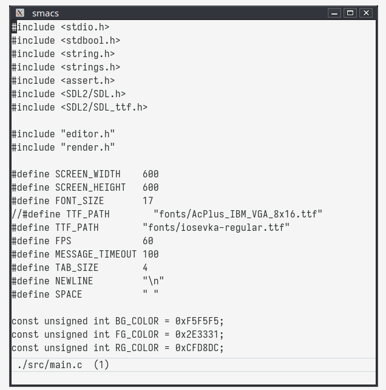

# Smacs (Short eMACS)

Custom implementation of Emacs-like text editor.

## Motivation

I like [Emacs](https://emacsdocs.org/) and I want to learn how this kind of app works internally.

## Warning
This app can not work correctly in Mac OS by some reason.

## Mappings

In the following keybinding description I use standard Emacs key definition:

- C - Ctrl
- M - Alt (Meta)

Bindings:

- C-f - forward char
- C-b - backward char
- C-n - next line
- C-p - previous line
- C-a - move cursor to the beginning of the line
- C-e - move cursor to the end of the line
- C-c - save file
- C-v - scroll up
- C-w - cut
- M-v - scroll down
- M-< - beginning of the buffer
- M-> - end of the buffer
- M-n - move line down
- M-p - move line up
- M-f - jump word forward
- M-b - jump word backward
- M-d - delete forward word
- M-@ - mark forward word
- M-( - wrap region in parenthesis
- C-, - duplicate line
- C-s - search
- C-k - delete from cursor position to the end of the line
- C-d - delete forward char
- BACKSPACE - delete backward char
- C-SPC - set mark
- M-w - copy to clipboard
- C-y - paste from clipboard
- C-l - recenter
- C-- - font size decrease
- C-= - font size increase
- C-q - next pane
- M-k - close pane
- m-u - upper case (allowed only region now)
- M-l - lower case (allowed only region now)
- C-i - switch buffer
- C-o - find file relativly current directory

Extended commands:
- C-x :{N} Enter - go to line {N}
- C-x n{N} Enter - go to Next {N} line
- C-x p{N} Enter - go to Previous {N} line

- C-x ff {file_path} Enter - open new file by {file_path} as a new buffer

- C-x sp Enter - split pane (now allowed only 3 horizontal slitted panes)

# Thanks
Everything works using [SDL](https://www.libsdl.org/).

Color theme in image inspired by [naysayer-theme](https://github.com/nickav/naysayer-theme.el) and [mindre-theme](https://github.com/erikbackman/mindre-theme)
