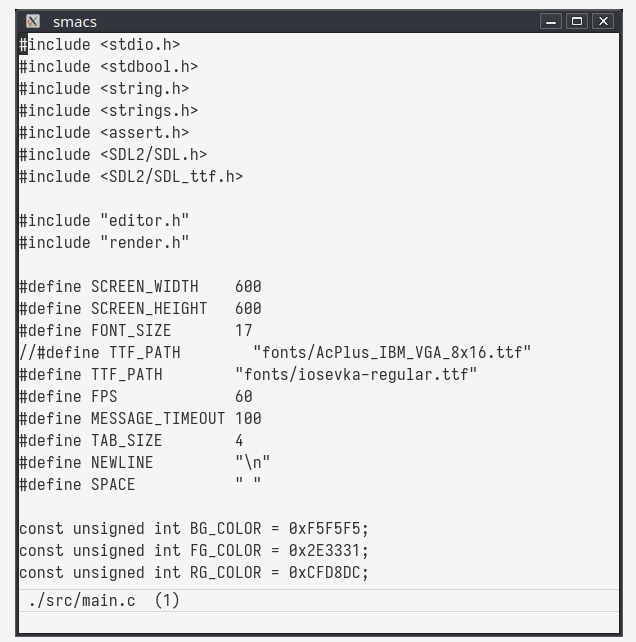

# Smacs (Short eMACS)

Custom implementation of Emacs-like text editor.

## Motivation

I like [Emacs](https://emacsdocs.org/) and I want to learn how this kind of app works internally.

## Reasonable syntax highlighting
Comments, chars, string literals, number. For me that enough for C lang development.

Everything is highlighted, nothing is highlighted.

## Warning
Development and usage performed only in Linux operation system. In Mac OS it might works with some bugs. In Windows it supposes to not work at all.

# Thanks
Everything works using [SDL](https://www.libsdl.org/).

Color themes in image inspired by
 - [naysayer-theme](https://github.com/nickav/naysayer-theme.el)
 - [mindre-theme](https://github.com/erikbackman/mindre-theme)
 - [acme editor](http://acme.cat-v.org/)
 - John Blow live streams
