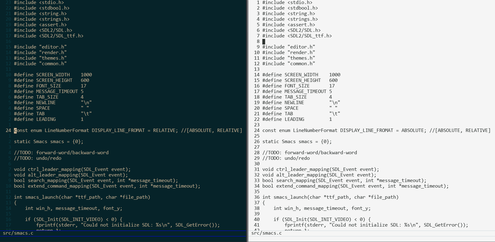

# Smacs (Short eMACS)

Custom implementation of Emacs-like text editor.

## Motivation

I like [Emacs](https://emacsdocs.org/) and I want to learn how this kind of app works internally.

## Warning
This app can not work correctly in Mac OS by some reason.

# Thanks
Everything works using [SDL](https://www.libsdl.org/).

Color theme in image inspired by [naysayer-theme](https://github.com/nickav/naysayer-theme.el) and [mindre-theme](https://github.com/erikbackman/mindre-theme)
